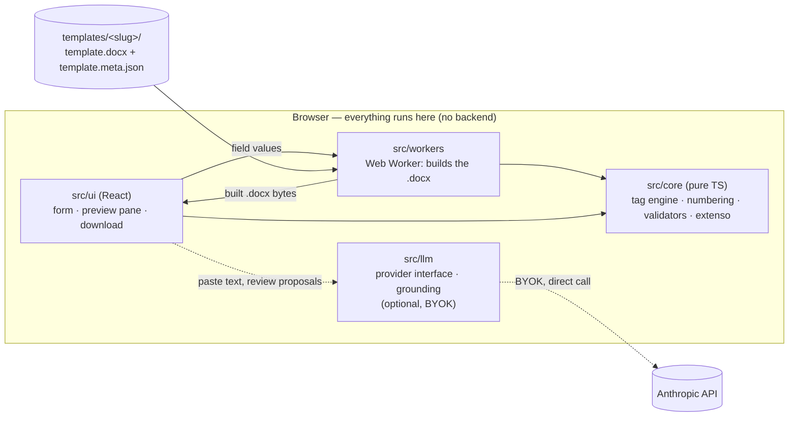

# minutas-lab

<!-- HUMAN: replace TODO-set-repo-owner below (matches .github/CODEOWNERS) once the repo exists on GitHub, so these badges resolve. -->
[](https://github.com/TODO-set-repo-owner/minutas-lab/actions/workflows/ci.yml)
[](https://scorecard.dev/viewer/?uri=github.com/TODO-set-repo-owner/minutas-lab)
[](./LICENSE)

Browser-only web app for filling Portuguese legal contract templates (DOCX with `{{tags}}`): pick a template, fill a validated form, see a live Word-like preview, download the complete DOCX. Optional LLM-assisted extraction of field values from pasted text (proposals only, never auto-applied, never overwrites a filled field silently). No backend, no database, no analytics — everything runs in your browser.

<!-- HUMAN: record a ~30s GIF of pick template -> fill a few fields -> live preview update -> download, and embed it here. -->

See [`AGENTS.md`](./AGENTS.md) for the full contributor/agent contract, [`SPEC.md`](./SPEC.md) for normative requirements, and [`ROADMAP.md`](./ROADMAP.md) for milestones.

## AI-assisted development

This project is built with substantial AI (LLM agent) assistance under human review — commits authored by an agent carry a co-author trailer, and every change must pass `npm run verify` before merge. See `AGENTS.md` for the autonomous workflow rules agents follow in this repo.

## Features

- **4 contract templates**: contrato-promessa de compra e venda, arrendamento urbano para habitação, empreitada, procuração — each a synthetic, original drafting (never a copy of a real firm's document, see `docs/templates.md`).
- **Live preview**: a Web Worker builds the actual `.docx` on every edit (debounced) and renders it via `docx-preview`, double-buffered so there's no flash/scroll-jump. Filled/empty fields are shaded directly in the preview.
- **Validation**: format/checksum (NIF, NIPC, IBAN, dates, amounts), conditional-required fields, cross-field rules (sums, date ordering, "must differ"), and structural checks (dangling references, duplicate anchors) — all defined per-template in `template.meta.json`.
- **Download**: final (blocked while any validation error remains, with a review-screen confirmation) or draft (always available, empty fields highlighted, "RASCUNHO" watermark) — both are the exact same render pipeline as the preview, so what you see is what you get.
- **Optional LLM-assisted extraction** (bring your own Anthropic API key, kept in memory only): paste text, review proposed field values against the exact quote they were grounded in, accept field-by-field. A proposal whose quote isn't a verbatim substring of the pasted text — or whose value doesn't match the quote's digits, for typed fields — is rejected before you ever see it.

## Architecture



`src/core` never touches the page DOM or the network — it's pure TypeScript, which is what lets the same tag-replacement/numbering/validation code run identically on the main thread (for live validation) and inside the Web Worker (for the actual build), and be unit-tested without a browser.

## Quickstart

```bash
npm ci
npm run dev
```

Open the printed local URL, pick a template, and start filling it in.

## Commands

| Command | Purpose |
|---|---|
| `npm ci` | install (lockfile only) |
| `npm run dev` | Vite dev server |
| `npm run verify` | typecheck + lint + unit tests + template lint + build — must pass before every commit/PR |
| `npm run test:cov` | unit tests with coverage |
| `npm run test:e2e` | Playwright + axe (needs `npx playwright install chromium` once) |
| `npm run lint:templates` | validates every `templates/*/template.docx` + `template.meta.json` |
| `npm run eval` | LLM eval with ReplayProvider (offline, deterministic) — not yet built, see ROADMAP M6 |
| `npm run eval:record` / `eval:live` | human-run only, need `LLM_API_KEY` |

## Status

M0-M6 (T6.1-T6.3) done — see [`ROADMAP.md`](./ROADMAP.md) for exact milestone status. Not yet deployed anywhere (local-only development phase; see `AGENTS.md` §6).

## License

MIT — see [`LICENSE`](./LICENSE).
